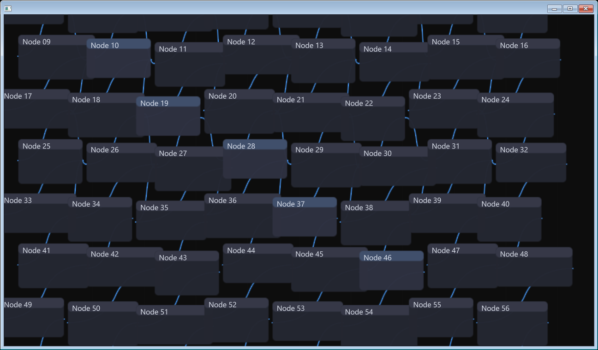
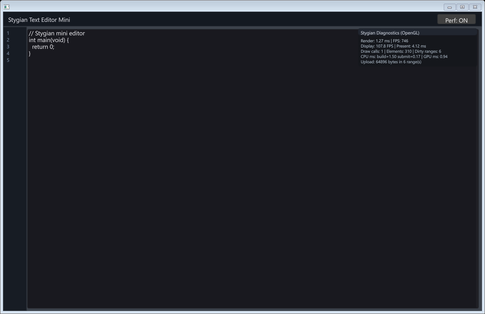
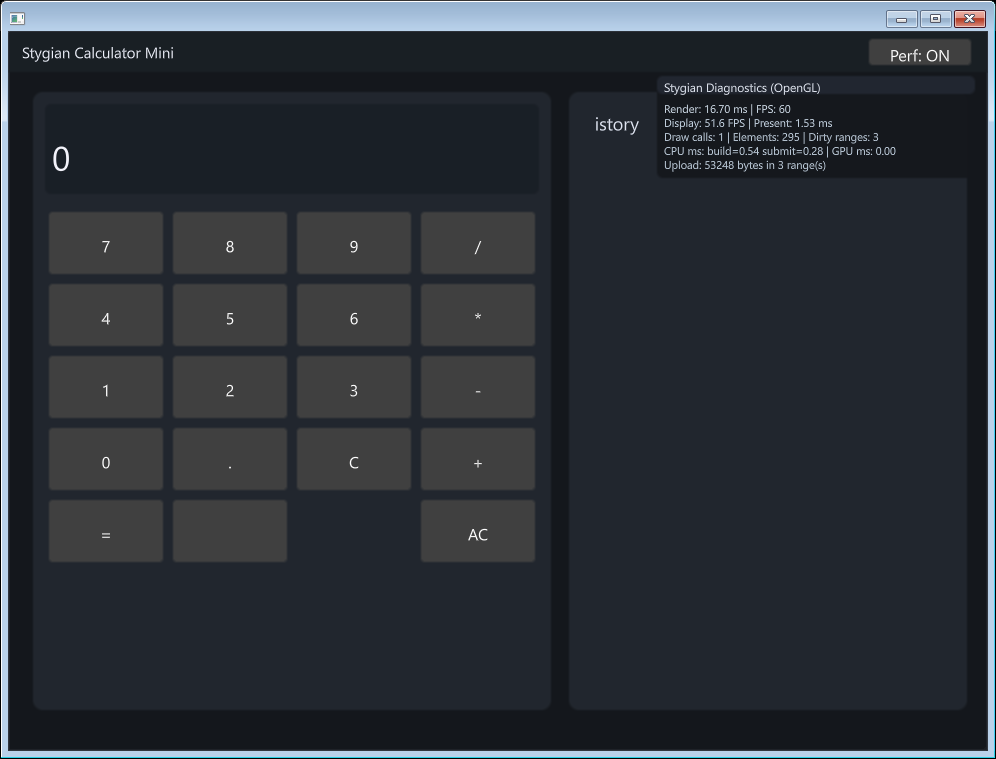

# Stygian
[](https://github.com/StygianFade/Stygian/actions/workflows/stygian-windows.yml)
[](https://github.com/StygianFade/Stygian/actions/workflows/stygian-linux.yml)
[](https://github.com/StygianFade/Stygian/actions/workflows/stygian-macos.yml)
[](LICENSE)

GPU-accelerated SDF UI and tool runtime for C23. Single draw call. Invalidation-driven. Cross-platform.

## What this is

Stygian is a native C23 UI library built around a DDI-style runtime: input and app logic classify impact, command producers publish mutations, the core commits deterministically into GPU-resident SoA buffers, then the frame either renders or skips. The point is simple: static UI should not rebuild and redraw just because input is still flowing through the app.

The core data model is triple-buffered SoA storage split into hot geometry/state, appearance, and effects buffers. Elements live on the GPU between frames, dirty chunk ranges are tracked explicitly, and clean scopes replay without re-uploading clean data. On a fully static frame, Stygian can stay in an eval-only or deep-wait path with zero upload and no forced redraw.

Rendering is SDF-first across the stack: window chrome, primitive shapes, editor wires, and text all feed the same GPU-native rendering model instead of dropping back to a pile of CPU triangles. OpenGL 4.3 and Vulkan access points are already implemented. Text uses MTSDF with the SGC glyph pipeline and compression policy selection for iGPU/dGPU targets. Output color management includes ICC-aware monitor binding on Win32. The current codebase also includes scope invalidation/replay, multi-producer command buffers with deterministic commit, custom titlebar and borderless behavior, dock/tabs, a node graph editor path, and a shipped widget baseline aimed at real desktop tools rather than toy demos.

## Platform Support

| Platform | Backend | Status |
|----------|---------|--------|
| Windows (Win32) | OpenGL 4.3 | Full |
| Windows (Win32) | Vulkan | Full |
| Linux (X11) | OpenGL 4.3 | Building |
| Linux (X11) | Vulkan | Building |
| macOS (Cocoa) | OpenGL | Building |

## Why Not others?

Stygian is not trying to be another immediate-mode triangle UI. The differentiation is: SDF-first rendering for shapes, chrome, wires, and text; invalidation-driven rendering instead of redraw-on-input; GPU-resident SoA element storage instead of per-frame CPU vertex rebuilds; generational element handles with deterministic commit; ICC-aware output handling; and MTSDF text with SGC glyph compression policy. Dear ImGui and Clay solve different problems; neither gives you this data-driven immediate DDI runtime with persistent scene/state backing, GPU-native SDF rendering, or color-management path.

## Quick Start

This program is the exact source used in `examples/quickwindow.c`.

```c
#include "stygian.h"
#include "stygian_window.h"

#ifdef STYGIAN_DEMO_VULKAN
#define STYGIAN_QUICK_BACKEND STYGIAN_BACKEND_VULKAN
#define STYGIAN_QUICK_WINDOW_RENDER_FLAG STYGIAN_WINDOW_VULKAN
#else
#define STYGIAN_QUICK_BACKEND STYGIAN_BACKEND_OPENGL
#define STYGIAN_QUICK_WINDOW_RENDER_FLAG STYGIAN_WINDOW_OPENGL
#endif

int main(void) {
    StygianWindowConfig win_cfg = {
        .width = 1280,
        .height = 720,
        .title = "Stygian Quick Window",
        .flags = STYGIAN_WINDOW_RESIZABLE | STYGIAN_QUICK_WINDOW_RENDER_FLAG,
    };
    StygianWindow *window = stygian_window_create(&win_cfg);
    if (!window) return 1;

    StygianConfig cfg = {
        .backend = STYGIAN_QUICK_BACKEND,
        .window = window,
    };
    StygianContext *ctx = stygian_create(&cfg);
    if (!ctx) {
        stygian_window_destroy(window);
        return 1;
    }

    StygianFont font = stygian_font_load(ctx, "assets/atlas.png", "assets/atlas.json");
    while (!stygian_window_should_close(window)) {
        StygianEvent event;
        while (stygian_window_poll_event(window, &event)) {
            if (event.type == STYGIAN_EVENT_CLOSE) stygian_window_request_close(window);
        }

        int width, height;
        stygian_window_get_size(window, &width, &height);
        stygian_begin_frame(ctx, width, height);
        stygian_rect(ctx, 10, 10, 200, 100, 0.2f, 0.3f, 0.8f, 1.0f);
        if (font) stygian_text(ctx, font, "Hello", 20, 50, 16.0f, 1, 1, 1, 1);
        stygian_end_frame(ctx);
    }

    if (font) stygian_font_destroy(ctx, font);
    stygian_destroy(ctx);
    stygian_window_destroy(window);
    return 0;
}
```

## Architecture

Frame pipeline: `Collect -> Commit -> Evaluate -> Render/Skip`

Runtime model details live in [docs/architecture/runtime_model.md](docs/architecture/runtime_model.md). A pipeline diagram for docs and onboarding use lives in [docs/architecture/pipeline_diagram.md](docs/architecture/pipeline_diagram.md).

## Benchmarks

Current performance notes and comparison methodology live in [docs/perf/benchmark_comparison.md](docs/perf/benchmark_comparison.md).

The Windows comparison harness, scene coverage, and toolchain caveats live in [benchmarks/comparison/README.md](benchmarks/comparison/README.md).

Read the benchmark material in this order:

- `docs/perf/benchmark_comparison.md` for benchmark lanes, hardware context, and the current Stygian baseline
- `benchmarks/comparison/latest_results.md` -> `Stygian Native Modes` for Stygian's native GPU-path measurements
- `benchmarks/comparison/latest_results.md` -> `CPU Builder Rows` for the narrower cross-library CPU authoring lane

The important distinction is simple:

- the CPU-builder lane is not Stygian's home field
- the native GPU-path lane is
- Stygian should be judged primarily as a GPU-native SDF tool runtime, not as a lightweight CPU command builder

## Screenshots

Node graph demo:



Text editor mini:



Calculator mini:



## Widgets

Shipped widgets:

- [Done] `button`, `button_ex`
- [Done] `slider`, `slider_ex`
- [Done] `checkbox`, `radio_button`
- [Done] `text_input`, `text_area`
- [Done] `scrollbar_v`
- [Done] `tooltip`
- [Done] `context_menu`
- [Done] `modal`
- [Done] `panel`
- [Done] `perf_widget`
- [Done] `file_explorer`, `breadcrumb`
- [Done] `output_panel`, `problems_panel`
- [Done] `debug_toolbar`, `call_stack`
- [Done] `coordinate_input`, `snap_settings`
- [Done] `cad_gizmo`, `layer_manager`
- [Done] `scene_viewport`, `scene_hierarchy`, `inspector`, `asset_browser`, `console_log`
- [Done] `split_panel`, `menu_bar`, `toolbar`
- [Done? still needs work] `node_graph` helpers and node/wire drawing path

Roadmap and broader taxonomy live in [widgets/WIDGET_TAXONOMY.md](widgets/WIDGET_TAXONOMY.md).

## Build

Windows:

1. Build shader outputs when they need refresh: `compile\windows\build_shaders.bat`
2. Build a manifest target through the unified entrypoint:
   `powershell -NoProfile -ExecutionPolicy Bypass -File compile\run.ps1 -Target quickwindow`
3. Run the binary from `build\`

Linux:

1. Make scripts executable: `chmod +x compile/run.sh compile/linux/build.sh`
2. Build a target: `compile/run.sh --target quickwindow`

macOS:

1. Make scripts executable: `chmod +x compile/run.sh compile/macos/build.sh`
2. Build a target: `compile/run.sh --target quickwindow`

Manifest targets are declared in [compile/targets.json](compile/targets.json).

### Backend Switching Rules

All three layers need to agree:

1. `StygianConfig.backend` in source
2. window render flag in source: `STYGIAN_WINDOW_OPENGL` or `STYGIAN_WINDOW_VULKAN`
3. target backend in [compile/targets.json](compile/targets.json): `"gl"` or `"vk"`

If only one of those changes, the build can still compile and then lie to you at runtime.

## Verification

Tiered checks:

- Tier 1: `tests/run_tier1_safety.ps1`
- Tier 2: `tests/run_tier2_runtime.ps1`
- Tier 3: `tests/run_tier3_misuse.ps1`
- All tiers: `tests/run_all.ps1`

## License

Stygian source code is MIT licensed. See [LICENSE](LICENSE).

The SGC emoji assets under `assets/sgc/` are third-party works with their own licenses and attribution requirements. Keep those notices intact when redistributing assets.
