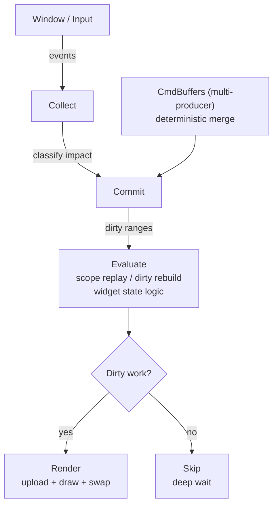

# Stygian Frame Pipeline

## ASCII Diagram

```text
┌─────────────┐   events    ┌──────────────┐
│   Window /  │────────────▶│   Collect    │
│   Input     │             └──────┬───────┘
└─────────────┘                    │ classify impact
                                   ▼
                            ┌──────────────┐
                 producers  │   Commit     │ ◀── CmdBuffers (multi-producer)
                            │ (SoA writes) │     deterministic merge
                            └──────┬───────┘
                                   │ dirty ranges
                                   ▼
                            ┌──────────────┐
                            │   Evaluate   │ scope replay / dirty rebuild
                            │  (DDI check) │ widget state logic
                            └──────┬───────┘
                                   │
               ┌───────────────────┴───────────────────┐
               │ dirty?                                 │ clean?
               ▼                                       ▼
        ┌──────────────┐                       ┌──────────────┐
        │    Render    │                       │     Skip     │
        │  (upload +   │                       │  (deep wait) │
        │  draw + swap)│                       └──────────────┘
        └──────────────┘
```

## Mermaid Diagram



## SoA Buffer Layout

```text
Element ID -> chunk index -> offset within chunk

StygianSoAHot[N]:        bounds(x,y,w,h), color(rgba), tex_id, type, flags, z
StygianSoAAppearance[N]: border(rgba), radius(tl,tr,br,bl), uv(u0,v0,u1,v1), control pts
StygianSoAEffects[N]:    shadow(offset,blur,spread,rgba), gradient(angle,rgba×2), hover, blend, blur, glow

Per chunk: { version, dirty_min, dirty_max } × 3 buffers
Backend uploads only dirty chunks. Clean chunks are skipped.
```

The runtime contract behind this diagram is documented in [runtime_model.md](runtime_model.md).
